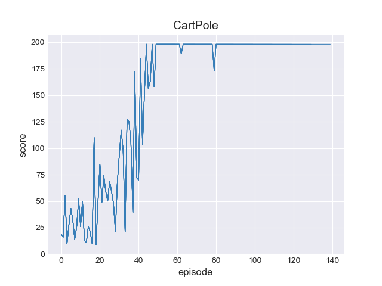

# PyTorch Implementation of Proximal Policy Optimization (PPO)

### Result

OpenAI [defines](https://github.com/openai/gym/blob/master/gym/envs/classic_control/cartpole.py) CartPole as solved "when the average reward is greater than or equal to 195.0 over 100 consecutive trials."

### Hyperparameter used

gamma = 0.99

lambda = 0.95

update_freq = 1

k_epoch = 3

initial_learning_rate = 0.02

eps_clip = 0.2

v_coef = 1

entropy_coef = 0.01

### References

[Proximal Policy Optimization Algorithms](https://arxiv.org/abs/1707.06347)

[seungeunrho](https://github.com/seungeunrho)/[minimalRL](https://github.com/seungeunrho/minimalRL)